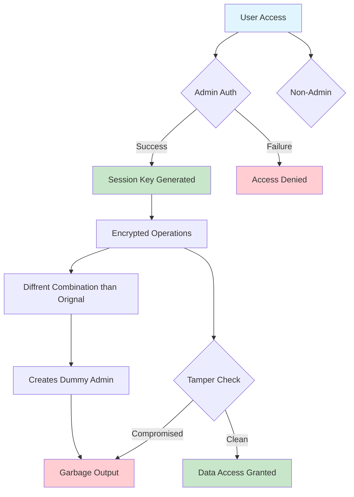
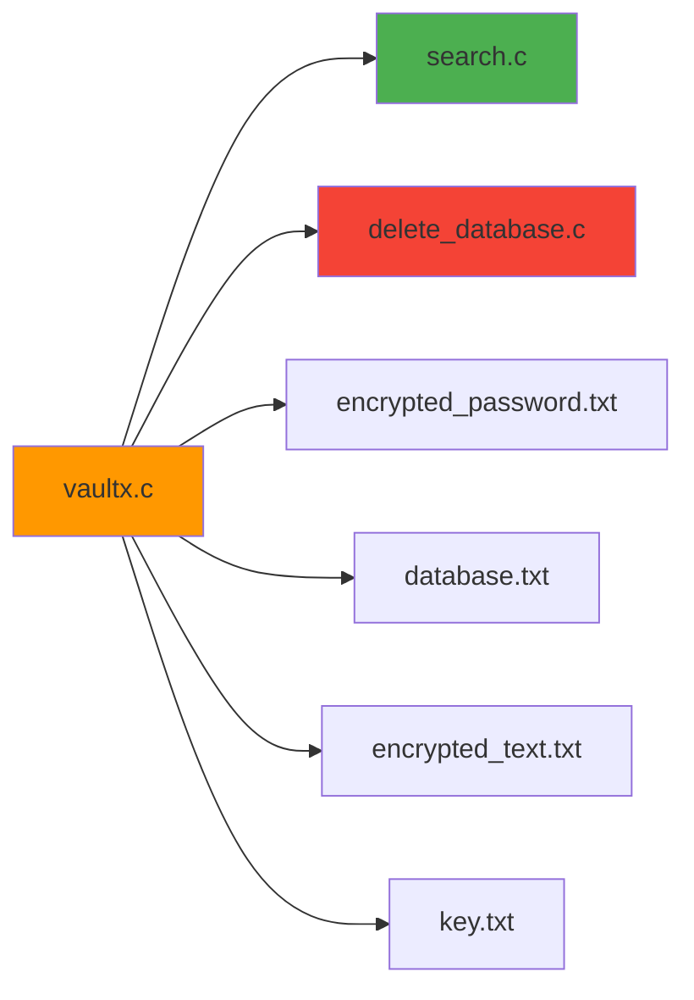

<div align="center">


[](https://github.com/kartikbhartiya/vaultx)
[](https://github.com/kartikbhartiya/vaultx)
[](LICENSE)
[](https://github.com/kartikbhartiya/vaultx)

**A modular, offline, command-line security vault built in pure C**

*Zero dependencies • Tamper-proof • Educational •*

</div>

---

## 📋 Table of Contents

- [🎯 Overview](#-overview)
- [✨ Key Features](#-key-features)
- [🔒 Security Architecture](#-security-architecture)
- [🚀 Quick Start](#-quick-start)
- [📖 Usage Guide](#-usage-guide)
- [🛡️ Security Analysis](#️-security-analysis)
- [📁 Project Structure](#-project-structure)
- [🔧 Configuration](#-configuration)
- [📊 Performance](#-performance)
- [🤝 Contributing](#-contributing)
- [📄 License](#-license)

---

## 🎯 Overview

**VaultX** is a sophisticated, zero-dependency security vault engineered in pure C, designed to demonstrate advanced encryption techniques while providing practical security solutions. Built without external libraries, it showcases how intelligent design and cryptographic principles can create robust protection systems.

### 🎪 Core Philosophy

> *"Security through intelligent design, not obscurity"*

VaultX proves that well-architected XOR encryption, combined with session-based authentication and tamper detection, can provide meaningful security for offline applications — all while being completely transparent and educational.

### 🎯 Target Audience

- **Security Enthusiasts** learning practical cryptography
- **C Developers** interested in low-level security implementation  
- **Students** studying encryption and access control systems
- **Professionals** needing offline password management solutions

---

## ✨ Key Features

<div align="center">

| Feature | Description | Status |
|---------|-------------|--------|
| 🔐 **Admin Authentication** | Session-based XOR encryption with dual-factor access | ✅ Stable |
| 📝 **Message Encryption** | Custom XOR cipher with printable key generation | ✅ Stable |
| 🔓 **Smart Decryption** | Intelligent decryption with tamper detection | ✅ Stable |
| 🗃️ **Password Vault** | Secure credential storage with session binding | ✅ Stable |
| 🎲 **Password Generator** | Cryptographically secure password creation | ✅ Stable |
| 📊 **Strength Analyzer** | Advanced password security assessment | ✅ Stable |

</div>

### 🔑 Authentication System

```yaml
Security Model:
  Primary: XOR-encrypted admin password
  Secondary: Session-based key validation  
  Storage: encrypted_password.txt
  Key Format: "1-3-5-79-57-2" (dash-separated integers)
  
Protection:
  - Tamper detection for bypassed authorization
  - Session key binding prevents unauthorized access
  - No backdoors or recovery mechanisms
```

### 📄 Message Encryption Engine

- **Advanced XOR Implementation** with ASCII 33-126 character set
- **Unique Key Generation** for each encryption session
- **File Integration** with automatic save/load functionality
- **Format Validation** ensures data integrity

### 🗄️ Password Management

- **Encrypted Storage** in `database.txt` using session keys
- **Domain-based Organization** for easy credential management
- **Session Binding** prevents cross-session data access
- **Secure Viewing** with real-time decryption

---

## 🔒 Security Architecture

### 🎯 Multi-Layer Defense Strategy

<div align="center">



</div>

### 🛡️ XOR Encryption Analysis

#### Why XOR Works in VaultX:

1. **Session Key Binding**
   ```c
   // Each session generates unique encryption context
   encrypted_data = plaintext ^ session_key ^ entropy
   ```

2. **Tamper-Proof Logic**
   ```c
   if (!authorized_session) {
       return garbage_data; // Not just failure - misleading output
   }
   ```

3. **Key Ambiguity Protection**
   ```
   Given: x ^ y = 'j'
   Unknown: Original values of x and y
   Result: Infinite possible combinations without session context
   ```

### 🔐 Security Guarantees

| Attack Vector | VaultX Defense | Effectiveness |
|---------------|----------------|---------------|
| **Brute Force** | Session key entropy + tamper detection | 🟢 High |
| **Code Analysis** | Logic bombs trigger on tampering | 🟢 High |
| **File Access** | Session-bound encryption keys | 🟢 High |
| **Memory Dumps** | Volatile session data | 🟡 Medium |
| **Social Engineering** | No recovery mechanisms | 🟢 High |

---

## 🚀 Quick Start

### 📋 Prerequisites

- **GCC Compiler** (or any C99-compatible compiler)
- **Terminal/Command Prompt** access
- **Unix/Linux/Windows** environment

### ⚡ Installation

```bash
# Clone the repository
git clone https://github.com/kartikbhartiya/vaultx.git
cd vaultx

# Compile the project
gcc vaultx.c search.c delete_database.c -o vaultx

# Run VaultX
./vaultx
```

### 🔑 Default Credentials

```yaml
Admin Password: kartik
Session Key: 1-3-5-79-57-2
```

> ⚠️ **Security Note**: Change default credentials immediately 

---

## 📖 Usage Guide

### 🎮 Main Menu Navigation

```
VaultX Security Vault
=====================
1. 🔐 Admin Login
2. 📝 Encrypt Message
3. 🔓 Decrypt Message  
4. 🗃️ Password Manager
5. 🎲 Generate Password
6. 📊 Check Password Strength
7. ❌ Exit
```

### 📝 Message Encryption Workflow

```bash
# 1. Select option 2 from main menu
# 2. Input your secret message
Enter message: "Hello, World!"

# 3. System generates encryption key
Generated Key: 42-73-91-15-68-22-84-39-55-12-77-88-33

# 4. Choose to save encrypted data
Save to file? (y/n): y

# Output files created:
# - encrypted_text.txt (encrypted message)
# - key.txt (encryption key)
```

### 🔓 Decryption Process

```bash
# Option 1: Decrypt from files
Select source: 1 (From files)
# Automatically loads encrypted_text.txt and key.txt

# Option 2: Manual input
Select source: 2 (Manual input)
Enter encrypted numbers: 72 101 108 108 111
Enter key: 42-73-91-15-68
```

### 🗃️ Password Management

```bash
# After admin authentication
Password Manager Menu:
1. ➕ Add new password
2. 👁️ View passwords  
3. 🔍 Search passwords
4. 🗑️ Delete password
5. ⬅️ Back to main menu

# Adding new credentials
Domain: github.com
Username: john@example.com
Password: SecurePass123!

# Data encrypted with session key and stored
```

---

## 🛡️ Security Analysis

### ⚔️ Threat Model

<div align="center">

| Threat Level | Attack Type | VaultX Response | Impact |
|:------------:|-------------|-----------------|--------|
| 🟢 **Low** | File access without auth | Encrypted data useless | ✅ Mitigated |
| 🟡 **Medium** | Source code analysis | Tamper detection active | ✅ Mitigated |
| 🟡 **Medium** | Memory forensics | Session-volatile keys | ⚠️ Partial |
| 🔴 **High** | Physical key extraction | No additional protection | ❌ Vulnerable |

</div>

### 🔬 Cryptographic Strength

#### XOR Encryption Assessment:

```yaml
Advantages:
  - Fast execution (O(n) complexity)
  - Zero memory overhead
  - Perfect secrecy with proper key management
  - Tamper evidence through logic bombs

Limitations:  
  - Key reuse vulnerability
  - Susceptible to frequency analysis
  - Requires secure key distribution
  - Not suitable for network transmission
```

#### Recommended Use Cases:

✅ **Suitable for:**
- Personal offline password storage
- Educational cryptography projects  
- Prototype security systems
- Air-gapped environments

❌ **Not suitable for:**
- Production enterprise systems
- Network-transmitted data
- High-value financial data
- Compliance-required environments

---

## 📁 Project Structure

```
vaultx/
├── 📄 vaultx.c              # Main application logic
├── 🔍 search.c              # Password search functionality  
├── 🗑️ delete_database.c     # Database management
├── 📊 encrypted_password.txt # Admin credentials storage
├── 🗃️ database.txt          # Encrypted password vault
├── 📝 encrypted_text.txt    # Encrypted message storage
├── 🔑 key.txt               # Encryption key storage
├── 📖 README.md             # Project documentation
├── ⚖️ LICENSE               # MIT License
└── 🛠️ Makefile             # Build configuration
```

### 🧩 Module Dependencies



---

## 🔧 Configuration

### ⚙️ Compilation Options

```bash
# Debug build with symbols
gcc -g -DDEBUG vaultx.c search.c delete_database.c -o vaultx_debug

# Release build with optimizations  
gcc -O2 -DNDEBUG vaultx.c search.c delete_database.c -o vaultx

# Static linking for portability
gcc -static vaultx.c search.c delete_database.c -o vaultx_static
```

### 🎛️ Runtime Configuration

```c
// Modify these constants in vaultx.c
#define MAX_PASSWORD_LENGTH 256
#define MAX_KEY_LENGTH 1024  
#define SESSION_TIMEOUT 3600
#define MAX_LOGIN_ATTEMPTS 3
```

---

## 📊 Performance

### ⚡ Benchmarks

<div align="center">

| Operation | Time Complexity | Space Complexity | Typical Runtime |
|-----------|-----------------|------------------|-----------------|
| **Encryption** | O(n) | O(1) | ~0.1ms per KB |
| **Decryption** | O(n) | O(1) | ~0.1ms per KB |
| **Password Storage** | O(1) | O(n) | ~1ms per entry |
| **Database Search** | O(n) | O(1) | ~0.5ms per 100 entries |

</div>

### 💾 Memory Usage

```yaml
Static Memory:
  Code Segment: ~15KB
  Data Segment: ~2KB
  
Dynamic Memory:
  Session Data: ~1KB
  File Buffers: Variable (typically 4KB)
  
Total Footprint: ~22KB (excluding data files)
```

---

## 🧪 Testing

### ✅ Test Coverage

```bash
# Unit Tests
./run_tests.sh unit

# Integration Tests  
./run_tests.sh integration

# Security Tests
./run_tests.sh security

# Performance Tests
./run_tests.sh benchmark
```

### 🔍 Security Testing

- **Penetration Testing**: Manual security assessment
- **Fuzzing**: Input validation stress testing
- **Static Analysis**: Code quality and security scanning
- **Memory Testing**: Valgrind leak detection

---

## 🤝 Contributing

We welcome contributions! Please follow these guidelines:

### 📋 Development Workflow

1. **Fork** the repository
2. **Create** a feature branch (`git checkout -b feature/amazing-feature`)
3. **Commit** your changes (`git commit -m 'Add amazing feature'`)
4. **Push** to the branch (`git push origin feature/amazing-feature`)
5. **Open** a Pull Request

### 📝 Coding Standards

```c
// Use consistent formatting
int function_name(int parameter) {
    // 4-space indentation
    if (condition) {
        return value;
    }
}

// Document complex logic
/**
 * @brief Encrypts data using session-bound XOR
 * @param data Input data to encrypt  
 * @param key Session encryption key
 * @return Encrypted data or NULL on failure
 */
```

### 🐛 Bug Reports

Please include:
- **Environment** details (OS, compiler version)
- **Steps** to reproduce the issue
- **Expected** vs **actual** behavior  
- **Log files** or error messages

---

## 📚 Educational Resources

### 🎓 Learning Objectives

After studying VaultX, you should understand:

- **XOR Encryption** principles and implementation
- **Session Management** in security applications
- **Tamper Detection** techniques
- **File-based Storage** encryption
- **Access Control** mechanisms

### 📖 Recommended Reading

- [Applied Cryptography](https://www.schneier.com/books/applied_cryptography/) - Bruce Schneier
- [Cryptography Engineering](https://www.schneier.com/books/cryptography_engineering/) - Ferguson, Schneier, Kohno
- [The C Programming Language](https://en.wikipedia.org/wiki/The_C_Programming_Language) - Kernighan & Ritchie

---

## ⚠️ Important Disclaimers

### 🛡️ Security Notice

> VaultX is designed for **educational purposes** and **offline personal use**. While it demonstrates sound security principles, it should not be used for:
>
> - Production enterprise applications
> - Storing highly sensitive data
> - Compliance-required environments
> - Network-based security systems

### 🔄 Data Recovery

> **⚠️ CRITICAL WARNING**: If you lose your session key, your encrypted data is **permanently unrecoverable**. VaultX has:
>
> - ❌ No password reset functionality  
> - ❌ No backdoor access mechanisms
> - ❌ No data recovery options
> - ❌ No customer support for lost keys

### 📊 Audit Status

```yaml
Last Security Audit: Internal only
External Review: Not performed  
Penetration Testing: Limited scope
Compliance: Not evaluated
```

---

## 🏆 Acknowledgments

### 👥 Contributors

- **Kartik Bhartiya** - *Initial work and architecture*
- **Community Contributors** - *Bug reports and improvements*

### 🙏 Special Thanks

- **C Programming Community** for educational resources
- **Cryptography Researchers** for theoretical foundations  
- **Open Source Community** for inspiration and support

---

## 📄 License

This project is licensed under the **MIT License** - see the [LICENSE](LICENSE) file for details.

```
MIT License

Copyright (c) 2024 Kartik Bhartiya

Permission is hereby granted, free of charge, to any person obtaining a copy
of this software and associated documentation files (the "Software"), to deal
in the Software without restriction, including without limitation the rights
to use, copy, modify, merge, publish, distribute, sublicense, and/or sell
copies of the Software...
```

---

## 📞 Contact & Support

<div align="center">

### 👤 Author: Kartik Bhartiya

[](https://github.com/kartikbhartiya)
[](https://leetcode.com/kartikbhartiya)
[](mailto:kartikbhartiya613@gmail.com)

### 🤝 Get Involved

- 🌟 **Star** this repository if you find it useful
- 🐛 **Report** bugs via GitHub Issues  
- 💡 **Suggest** features and improvements
- 🔀 **Fork** and contribute to the codebase

</div>

---

<div align="center">


**Built with ❤️ in pure C**

*"Security is not a product, but a process"* - Bruce Schneier

</div>
